<h1 align="center">Hi 👋, I'm Gael Lopes</h1>

  <strong>DevOps Tech Lead • DevSecOps • Platform Engineering • GitOps • CI/CD Security • Observability</strong>

  

  <em> Visitor count 👇</em>
    
  

 

  
  
  
  

  

## 📌 Pinned Projects

  

## 😊 About Me

- 🔭 **DevOps Tech Lead (Public Sector | Ceará, BR)** — Platform Engineering, GitOps e CI/CD Security (SAST/SCA/DAST/IAST).
- 🔐 **DevSecOps na prática** — quality gates, supply chain (SBOM + assinatura), secrets management e hardening.
- 🚀 **Release engineering** — blue/green, canary e rollback rápido (Kubernetes / Docker / Swarm).
- 📈 **Observability** — OpenTelemetry + métricas/logs/traces com dashboards e alertas acionáveis.
- ⚙️ **IaC & automação** — Terraform/OpenTofu, Ansible e Bash para infra reprodutível e segura.
- 💬 Bora trocar ideia sobre DevOps/DevSecOps/GitOps/Full Cycle.
- ✍️ Escrevo no Medium sobre tecnologia, DevSecOps e segurança.

## 🔐 Security & Quality Gates (DevSecOps)

  
  
  
  
  
  
  
  
  
  
  
  

## 🔨 Languages and Tools

  
  
  
  
  
  
  
  
  
  
  
  
  
  
  
  
  
  
  
  
  
  
  
  
  
  
  
  
  
  

## 📊 GitHub Stats

  

## 🧠 GitHub Languages

  

## 🏆 GitHub Highlights

  

<!-- ## GitHub Unwrapped 2025 (Click to see the full 🎥)

  

 -->
